# 

**kigumi** performs regularized Boolean set operations on 3D regions defined by triangular boundary meshes. It is
written in C++ and based on [CGAL](https://www.cgal.org).

## Features

With **kigumi**, you can:

- Handle regions defined by closed or open, manifold or non-manifold meshes.
- Handle regions composed of disjoint components.
- Handle special regions: the empty set and the universe.
- Apply multiple Boolean operators simultaneously.
- Attach custom data to mesh faces that propagate through Boolean operations.
- Save regions without losing precision in a portable binary format.

For details of the API, check [Region.h](include/kigumi/Region.h)
and [Boolean_region_builder.h](include/kigumi/Boolean_region_builder.h).

## Benchmarks

Here are the timings (in seconds) for computing the Boolean intersection between meshes, excluding I/O time:

| Test case         | [coref.][coref] (seq.) | [geogram][geogram] (par.) | kigumi (seq.)¹ | kigumi (par.) | [libigl][libigl] (seq.)² | [manif.][manif] (seq.) | manif. (par.)³ | [MCUT][mcut] (par.) |
|-------------------|-----------------------:|--------------------------:|---------------:|--------------:|-------------------------:|-----------------------:|---------------:|--------------------:|
| **Open**          |                    4.6 |                    FAILED |            2.4 |           1.3 |                   FAILED |                 FAILED |         FAILED |              FAILED |
| **Open & closed** |                 FAILED |                      70.5 |            1.6 |           0.9 |                   FAILED |                 FAILED |         FAILED |              FAILED |
| **Closed**        |                   57.4 |                    FAILED |            5.3 |           2.7 |                     61.0 |                    8.9 |            1.7 |                24.5 |
| **Non-manifold**  |                 FAILED |                    FAILED |            0.5 |           0.3 |                   FAILED |                 FAILED |         FAILED |              FAILED |

¹ Ran with `KIGUMI_NUM_THREADS=1`. ² `igl::copyleft::cgal::mesh_boolean` with `CGAL::Lazy_exact_nt<mpq_class>` as the
number type was used. ³ Configured with `-DMANIFOLD_PAR=TBB`.

Benchmarks were performed on a MacBook Pro 13" (M1, 2020). Programs were built with Homebrew Clang 18.1.8. The following
commands were used:

```
./tools/gen_bench_meshes.sh
./tools/run_benches.sh
```

## Build instructions

[On Windows](docs/build-windows.md) • [On macOS](docs/build-macos.md) • [On Ubuntu](docs/build-ubuntu.md)

## [Using kigumi CLI](docs/cli.md)

## Technical details

Boundary meshes must satisfy the following conditions for Boolean operations to work properly. If any of these
conditions are not met, the result is undefined and may emit warnings, crash, or fail silently.

1. Meshes must not have degenerate (zero-area) faces.
1. Meshes must not self-intersect, i.e., every pair of distinct faces must meet one of the following conditions:
    - They share an edge but do not intersect elsewhere.
    - They share a vertex but do not intersect elsewhere.
    - They do not intersect at all.
1. Open meshes must be clipped with a common convex region.

Additional notes:

1. Faces that have more than three vertices are interpreted as triangle fans.

## Table of Boolean operators

> [!NOTE]
>
> The result of each Boolean operation is regularized, i.e., the interior of the result is taken first, followed by its
> closure.

| `Boolean_operator::`        | Set notation        | Venn diagram                              |
|-----------------------------|---------------------|-------------------------------------------|
| `V`                         | $U$ (the universe)  |  |
| `A`, `UNION`                | $A ∪ B$             | 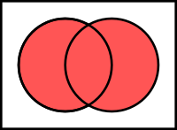 |
| `B`                         | $(B ⧵ A)^c$         | 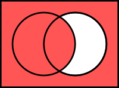 |
| `C`                         | $(A ⧵ B)^c$         | 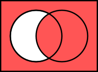 |
| `D`                         | $(A ∩ B)^c$         | 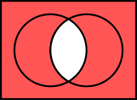 |
| `E`                         | $(A △ B)^c$         | 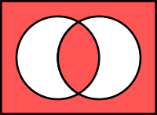 |
| `F`                         | $A^c$               | 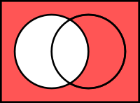 |
| `G`                         | $B^c$               | 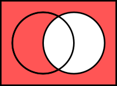 |
| `H`                         | $B$                 | 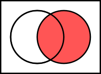 |
| `I`                         | $A$                 |  |
| `J`, `SYMMETRIC_DIFFERENCE` | $A △ B$             | 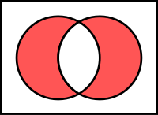 |
| `K`, `INTERSECTION`         | $A ∩ B$             | 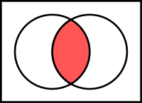 |
| `L`, `DIFFERENCE`           | $A ⧵ B$             | 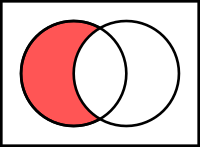 |
| `M`                         | $B ⧵ A$             | 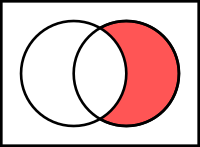 |
| `X`                         | $(A ∪ B)^c$         | 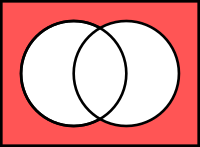 |
| `O`                         | $∅$ (the empty set) | 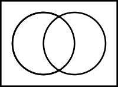 |

## Algorithm

An enhanced version of the algorithm described in [[1]](#1) is used.

## References

- <a id="1">[1]</a> Barki, H., Guennebaud, G., & Foufou, S. (2015). Exact, robust, and efficient regularized Booleans on
  general 3D meshes. _Computers & Mathematics With Applications_, _70_(6),
  1235–1254. [https://doi.org/10.1016/j.camwa.2015.06.016](https://doi.org/10.1016/j.camwa.2015.06.016)

[coref]: https://doc.cgal.org/latest/Polygon_mesh_processing/index.html#Coref_section

[geogram]: https://github.com/BrunoLevy/geogram

[libigl]: https://github.com/libigl/libigl

[manif]: https://github.com/elalish/manifold

[mcut]: https://github.com/cutdigital/mcut
