# Table of Boolean operators

All 16 Boolean operators are supported:

| `Boolean_operator::`           | Set notation       | Venn diagram                         |
| ------------------------------ | ------------------ | ------------------------------------ |
| `V`                            | $U$, the universe  | 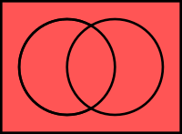 |
| `A`, `UNION`                | $A ∪ B$            | 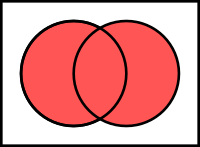 |
| `B`                            | $(B ⧵ A)^c$        | 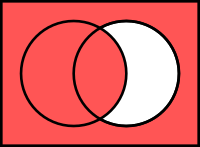 |
| `C`                            | $(A ⧵ B)^c$        | 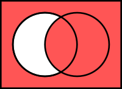 |
| `D`                            | $(A ∩ B)^c$        | 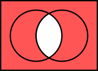 |
| `E`                            | $(A △ B)^c$        | 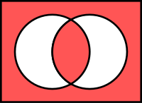 |
| `F`                            | $A^c$              | 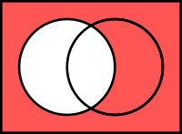 |
| `G`                            | $B^c$              | 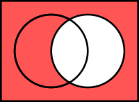 |
| `H`                            | $B$                | 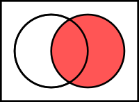 |
| `I`                            | $A$                | 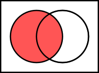 |
| `J`, `SYMMETRIC_DIFFERENCE` | $A △ B$            | 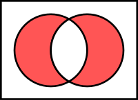 |
| `K`, `INTERSECTION`         | $A ∩ B$            | 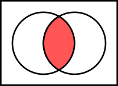 |
| `L`, `DIFFERENCE`           | $A ⧵ B$            | 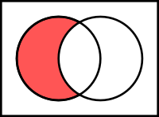 |
| `M`                            | $B ⧵ A$            | 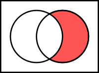 |
| `X`                            | $(A ∪ B)^c$        | 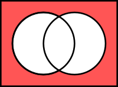 |
| `O`                            | $∅$, the empty set | 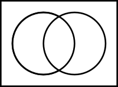 |

## Notes

- The result of each Boolean operation is regularized, i.e., the interior of the result is taken first, followed by its closure.
- The alphabets are the Bocheński notation.
